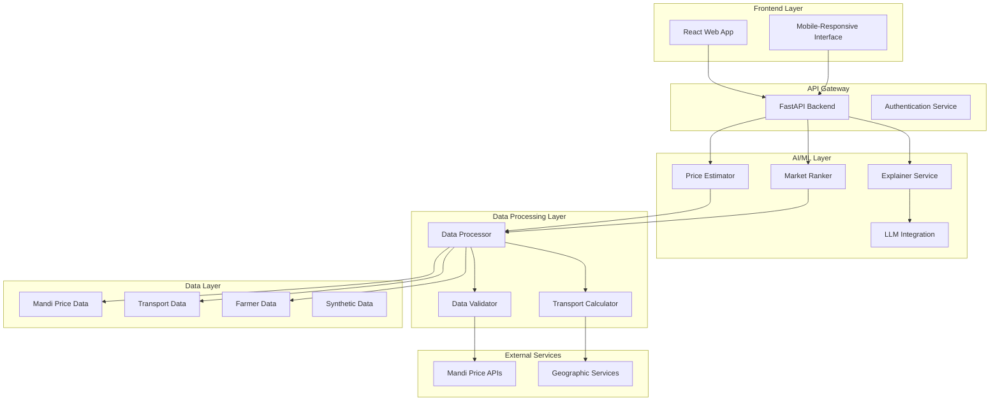

# Design Document: AI Market Access & Fair Pricing Intelligence

## Overview

The AI Market Access & Fair Pricing Intelligence system is designed as a web-based platform that empowers small and marginal farmers in rural India with transparent, AI-driven market intelligence. The system combines historical mandi price data, transport cost analysis, and demand pattern recognition to provide fair price estimates and profitable market recommendations.

The architecture follows a layered approach with a React-based frontend, Python FastAPI backend, lightweight ML models for price prediction, and CSV/JSON storage for prototype deployment. The system emphasizes explainable AI to build farmer trust and uses LLMs for generating human-readable explanations in local languages.

## Architecture

### High-Level Architecture



### Component Breakdown

#### Frontend Components
- **User Interface**: React-based web application with mobile-responsive design
- **Input Forms**: Crop selection, quantity input, location picker
- **Results Display**: Price estimates, market rankings, profit calculations
- **Explanation Panel**: AI reasoning display with visual indicators
- **Language Support**: Multi-language interface with local language support

#### Backend Components
- **API Gateway**: FastAPI-based REST API handling all client requests
- **Authentication Service**: Basic user session management and data privacy
- **Request Router**: Routes requests to appropriate AI/ML services
- **Response Formatter**: Standardizes API responses and error handling

#### AI/ML Layer Components
- **Price Estimator**: Time series analysis using ARIMA/LSTM hybrid approach
- **Market Ranker**: Multi-criteria decision analysis with weighted scoring
- **Explainer Service**: Rule-based explanation generation with LLM enhancement
- **Model Manager**: Handles model loading, caching, and version management

#### Data Processing Components
- **Data Processor**: ETL pipeline for mandi data ingestion and cleaning
- **Transport Calculator**: Distance-based cost calculation with route optimization
- **Data Validator**: Quality checks and anomaly detection for incoming data
- **Cache Manager**: Redis-like caching for frequently accessed data

## Components and Interfaces

### Price Estimator Interface
```python
class PriceEstimator:
    def estimate_fair_price(
        self, 
        crop_type: str, 
        location: Location, 
        quantity: float,
        date: datetime
    ) -> PriceEstimate:
        """
        Estimates fair price using hybrid ARIMA-LSTM model
        Returns price estimate with confidence intervals
        """
        pass
    
    def get_price_trends(
        self, 
        crop_type: str, 
        location: Location, 
        days: int = 90
    ) -> List[PriceTrend]:
        """
        Retrieves historical price trends for trend analysis
        """
        pass
```

### Market Ranker Interface
```python
class MarketRanker:
    def rank_markets(
        self, 
        crop_type: str, 
        farmer_location: Location,
        quantity: float
    ) -> List[MarketRecommendation]:
        """
        Ranks markets by profitability considering transport costs
        Returns sorted list of market recommendations
        """
        pass
    
    def calculate_net_profit(
        self, 
        market: Market, 
        price: float, 
        quantity: float,
        transport_cost: float
    ) -> ProfitCalculation:
        """
        Calculates net profit after all deductions
        """
        pass
```

### Explainer Service Interface
```python
class ExplainerService:
    def explain_price_estimate(
        self, 
        estimate: PriceEstimate, 
        language: str = "hindi"
    ) -> Explanation:
        """
        Generates human-readable explanation for price estimates
        Uses LLM for natural language generation
        """
        pass
    
    def explain_market_ranking(
        self, 
        recommendations: List[MarketRecommendation],
        language: str = "hindi"
    ) -> List[Explanation]:
        """
        Explains why markets are ranked in specific order
        """
        pass
```

## Data Models

### Core Data Models

```python
@dataclass
class Location:
    latitude: float
    longitude: float
    district: str
    state: str
    pincode: Optional[str] = None

@dataclass
class PriceEstimate:
    crop_type: str
    estimated_price: float
    confidence_interval: Tuple[float, float]
    confidence_score: float
    factors: List[PriceFactor]
    timestamp: datetime

@dataclass
class MarketRecommendation:
    market_id: str
    market_name: str
    location: Location
    current_price: float
    transport_cost: float
    estimated_net_profit: float
    reliability_score: float
    distance_km: float
    rank: int

@dataclass
class ProfitCalculation:
    gross_revenue: float
    transport_cost: float
    market_fees: float
    handling_charges: float
    net_profit: float
    profit_margin: float

@dataclass
class Explanation:
    summary: str
    key_factors: List[str]
    reasoning: str
    confidence_note: str
    language: str
```

### Data Storage Models

```python
# Mandi Price Data Structure
{
    "market_id": "string",
    "market_name": "string", 
    "state": "string",
    "district": "string",
    "crop_name": "string",
    "variety": "string",
    "date": "YYYY-MM-DD",
    "min_price": "float",
    "max_price": "float",
    "modal_price": "float",
    "arrivals": "float"
}

# Transport Cost Data Structure
{
    "from_location": "Location",
    "to_location": "Location", 
    "distance_km": "float",
    "estimated_cost_per_kg": "float",
    "route_quality": "string",
    "last_updated": "datetime"
}
```

## AI & Decision Logic

### Fair Price Estimation Logic

The Price Estimator uses a hybrid approach combining traditional time series analysis with modern deep learning:

1. **Data Preprocessing**: Clean and normalize mandi price data, handle missing values using interpolation
2. **Trend Analysis**: Apply ARIMA models for capturing linear trends and seasonal patterns
3. **Pattern Recognition**: Use LSTM networks for non-linear pattern detection in price movements
4. **Ensemble Prediction**: Combine ARIMA and LSTM predictions using weighted averaging based on recent performance
5. **Confidence Calculation**: Generate confidence intervals using prediction variance and historical accuracy

**Key Factors Considered**:
- Historical price trends (90-day moving average)
- Seasonal patterns and crop cycles
- Market arrival volumes and supply indicators
- Regional price variations and arbitrage opportunities
- Weather impact indicators and crop condition reports

### Market Ranking Logic

The Market Ranker employs multi-criteria decision analysis with the following weighted scoring system:

1. **Price Score (40%)**: Current market price relative to regional average
2. **Profitability Score (30%)**: Net profit after transport and transaction costs
3. **Reliability Score (20%)**: Historical payment reliability and market stability
4. **Accessibility Score (10%)**: Distance, road quality, and transport availability

**Ranking Algorithm**:
```python
def calculate_market_score(market, base_factors):
    price_score = (market.current_price - regional_avg) / regional_avg
    profit_score = (net_profit - min_profit) / (max_profit - min_profit)
    reliability_score = market.reliability_rating / 5.0
    accessibility_score = 1.0 - (distance / max_distance)
    
    weighted_score = (
        price_score * 0.4 + 
        profit_score * 0.3 + 
        reliability_score * 0.2 + 
        accessibility_score * 0.1
    )
    return weighted_score
```

### Net Profit Optimization

The system calculates net profit using a comprehensive cost model:

**Revenue Calculation**:
- Gross Revenue = Quantity × Market Price

**Cost Components**:
- Transport Cost = Distance × Cost per KM × Quantity
- Market Fees = Gross Revenue × Market Fee Percentage (typically 1-2%)
- Handling Charges = Fixed cost per quintal
- Loading/Unloading = Fixed cost per trip

**Optimization Strategy**:
- Identify markets with highest net profit margins
- Consider transport cost efficiency (cost per km vs. price differential)
- Factor in market reliability to avoid payment delays
- Provide alternative recommendations for risk diversification

### Explainable AI Reasoning

The Explainer Service generates transparent, farmer-friendly explanations using a combination of rule-based logic and LLM enhancement:

**Explanation Generation Process**:
1. **Factor Identification**: Extract key factors that influenced the AI decision
2. **Impact Quantification**: Calculate relative importance of each factor
3. **Template Selection**: Choose appropriate explanation template based on decision type
4. **Language Generation**: Use LLM to generate natural language explanations
5. **Localization**: Translate and adapt explanations for local context

**Example Explanation Templates**:
- Price Estimate: "The recommended price of ₹X per quintal is based on recent market trends showing Y% increase, good demand in nearby markets, and transport costs of ₹Z per quintal."
- Market Ranking: "Market A is ranked first because it offers ₹X higher price than average, has reliable payment history, and transport cost is only ₹Y per quintal."

**Trust-Building Features**:
- Show confidence levels for all predictions
- Highlight uncertainty when data is limited
- Provide historical accuracy metrics
- Allow farmers to provide feedback on recommendation quality

## Correctness Properties

*A property is a characteristic or behavior that should hold true across all valid executions of a system—essentially, a formal statement about what the system should do. Properties serve as the bridge between human-readable specifications and machine-verifiable correctness guarantees.*

Based on the requirements analysis, the following properties ensure the system behaves correctly across all valid inputs and scenarios:

### Property 1: Price Estimation Completeness
*For any* valid crop type, quantity, and location input, the Price_Estimator should return a price estimate with confidence intervals within 30 seconds, using at least 90 days of historical data when available, or clearly indicate data limitations when using regional averages.
**Validates: Requirements 1.1, 1.2, 1.5**

### Property 2: Price Estimation Uncertainty Detection
*For any* price estimation request, when market volatility exceeds normal thresholds, the system should flag high uncertainty and provide appropriate confidence intervals reflecting the volatility.
**Validates: Requirements 1.3**

### Property 3: Data Freshness Consistency
*For any* price estimation request, the system should use data that has been updated within the last 24 hours, and price estimates should reflect the most recent available market data.
**Validates: Requirements 1.4**

### Property 4: Market Recommendation Completeness
*For any* farmer location, the Market_Ranker should return at least 5 markets within 100km radius (when available), with each recommendation including current prices, transport costs, and net profit calculations.
**Validates: Requirements 2.1, 3.1**

### Property 5: Market Ranking Logic Consistency
*For any* set of markets, the ranking should consistently prioritize markets based on the weighted combination of current prices, transport costs, demand patterns, and reliability scores, with markets having consistently higher prices over 30 days ranked higher.
**Validates: Requirements 2.2, 2.4, 2.5**

### Property 6: Transport Cost Calculation Accuracy
*For any* market recommendation, when distance data is available, transport costs should be calculated and displayed; when unavailable, standard per-kilometer rates should be used with clear indication of the estimation method.
**Validates: Requirements 2.3, 3.3**

### Property 7: Profit Calculation Completeness
*For any* market recommendation, the net profit calculation should include all cost components (transport costs, market fees, handling charges) deducted from gross revenue, with clear display of gross revenue, total costs, and net profit.
**Validates: Requirements 3.2, 3.4**

### Property 8: Low Profitability Warning System
*For any* profit calculation, when profit margins fall below 10%, the system should display appropriate warning indicators highlighting the low profitability.
**Validates: Requirements 3.5**

### Property 9: Explanation Generation Completeness
*For any* price estimate or market recommendation, the Explainer should generate human-readable explanations that include key influencing factors, trend descriptions when applicable, and highlight the most important factors affecting the decision.
**Validates: Requirements 4.1, 4.2, 4.3, 4.4**

### Property 10: Data Integration and Validation
*For any* mandi data processing operation, the system should validate data quality, flag anomalous entries, maintain at least 2 years of historical data, and handle data source unavailability gracefully with alternative recommendations.
**Validates: Requirements 5.1, 5.2, 5.3, 5.5**

### Property 11: Geographic Distance Calculation
*For any* transport cost calculation requiring distance data, the system should calculate distances using geographic coordinates or road network data and provide accurate distance measurements.
**Validates: Requirements 5.4**

### Property 12: Multi-language Support Consistency
*For any* user interaction, the system should accept input and display results in the farmer's preferred language, with visual indicators for important numerical data and contextual help available for key features.
**Validates: Requirements 6.2, 6.3, 6.5**

### Property 13: Offline Functionality and Caching
*For any* system operation during poor connectivity, cached recommendations should be provided with clear indication of data freshness, and critical data should be stored locally to enable basic functionality during network outages.
**Validates: Requirements 7.2, 7.5**

### Property 14: Load Management and Queuing
*For any* high system load scenario, requests should be queued appropriately and users should receive estimated wait times for their requests.
**Validates: Requirements 7.4**

### Property 15: Data Security and Privacy Protection
*For any* farmer data handling operation, data should be encrypted in transit and at rest, only essential data should be collected, individual data should not be shared without consent, location data should be anonymized for analysis, and farmers should have options to delete their data.
**Validates: Requirements 8.1, 8.2, 8.3, 8.4, 8.5**

### Property 16: Synthetic Data Generation and Separation
*For any* synthetic data generation operation, the system should create realistic farmer profiles with diverse crop types and locations, model seasonal patterns in demand data, maintain clear separation from production data, and ensure synthetic data represents diverse farming scenarios across regions.
**Validates: Requirements 9.1, 9.2, 9.4, 9.5**

### Property 17: Algorithm Validation with Synthetic Data
*For any* AI algorithm deployment, the system should validate algorithms using synthetic data before deployment with real farmer data, ensuring proper testing and validation procedures.
**Validates: Requirements 9.3**

## Error Handling

The system implements comprehensive error handling across all layers:

### Data Layer Error Handling
- **API Failures**: Graceful degradation when mandi price APIs are unavailable, using cached data with freshness indicators
- **Data Quality Issues**: Automatic detection and flagging of anomalous price entries, with fallback to regional averages
- **Missing Data**: Clear indication when data is insufficient, with transparent use of regional averages or historical patterns

### AI/ML Layer Error Handling
- **Model Failures**: Fallback to simpler statistical models when complex ML models fail
- **Prediction Uncertainty**: Clear communication of confidence levels and uncertainty ranges
- **Invalid Inputs**: Robust input validation with helpful error messages for farmers

### System Layer Error Handling
- **Network Issues**: Offline functionality with cached data and clear freshness indicators
- **High Load**: Request queuing with estimated wait times and graceful degradation
- **Authentication Errors**: Clear error messages with guidance for resolution

### User Experience Error Handling
- **Language Errors**: Fallback to default language with notification to user
- **Location Errors**: Approximate location detection with user confirmation
- **Input Validation**: Real-time validation with helpful correction suggestions

## Testing Strategy

The system employs a dual testing approach combining unit tests for specific scenarios and property-based tests for comprehensive validation:

### Property-Based Testing
- **Framework**: Hypothesis (Python) for generating diverse test inputs
- **Test Configuration**: Minimum 100 iterations per property test to ensure comprehensive coverage
- **Test Tagging**: Each property test tagged with format: **Feature: farmer-market-intelligence, Property {number}: {property_text}**
- **Coverage**: All 17 correctness properties implemented as property-based tests

### Unit Testing Strategy
- **Specific Examples**: Test concrete scenarios like specific crop-location combinations
- **Edge Cases**: Test boundary conditions such as zero quantities, extreme distances, missing data
- **Error Conditions**: Test system behavior under various failure scenarios
- **Integration Points**: Test API endpoints, data processing pipelines, and external service integrations

### Test Data Strategy
- **Synthetic Data**: Generate realistic test scenarios without compromising farmer privacy
- **Historical Data**: Use anonymized historical mandi data for validation
- **Edge Case Data**: Create specific test cases for boundary conditions and error scenarios
- **Performance Data**: Load testing with realistic user patterns and data volumes

### Testing Tools and Configuration
- **Backend Testing**: pytest with Hypothesis for property-based testing
- **API Testing**: FastAPI TestClient for endpoint testing
- **Frontend Testing**: Jest and React Testing Library for UI components
- **Integration Testing**: Docker-based testing environment with mock external services
- **Performance Testing**: Locust for load testing and performance validation

The testing strategy ensures that both individual components work correctly (unit tests) and that the system maintains its correctness properties across all possible inputs (property-based tests), providing comprehensive validation of the AI Market Access & Fair Pricing Intelligence system.